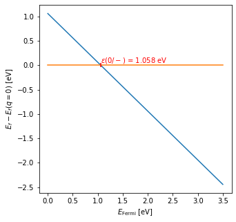
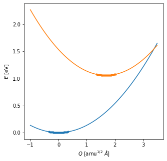
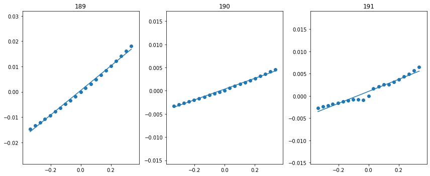
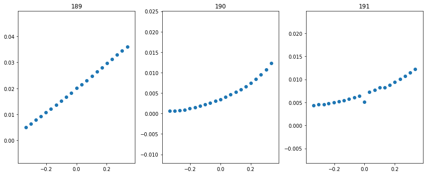
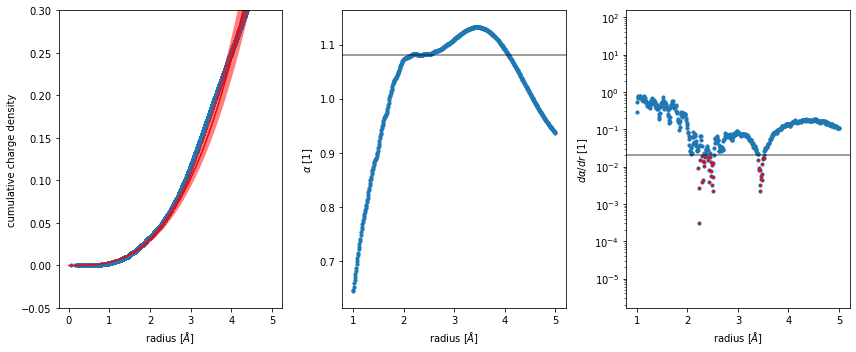
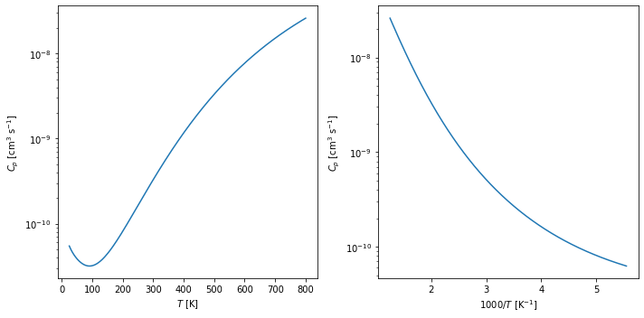
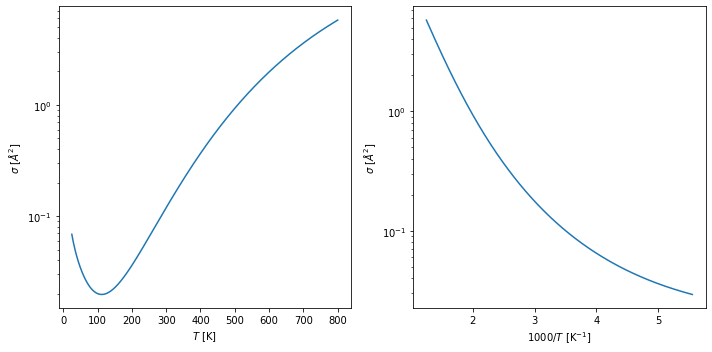

NONRAD Tutorial
===============

This notebook serves as a tutorial for how to use the NONRAD code to
compute the nonradiative capture coefficient for a given defect. In this
tutorial, we will examine the capture of a hole by the negatively charge
C substiution on the N site in wurtzite GaN.

**Recommendation**: For every function provided by NONRAD, read the
docstring to understand how the function behaves. This can be done using
``function?`` in a notebook or ``print(function.__doc__)``.

0. First-Principles Defect Calculation
--------------------------------------

Before we begin using the code provided by NONRAD, we must perform a
first-principles calculation to obtain the equilibrium structures and
thermodynamic level for our defect. This results in a formation energy
plot such as the following.

.. code:: ipython3

    %matplotlib inline
    import matplotlib.pyplot as plt
    import numpy as np
    
    Efermi = np.linspace(0., 3.5, 10)
    fig, ax = plt.subplots(figsize=(5, 5))
    ax.plot(Efermi, - Efermi + 1.058)
    ax.plot(Efermi, np.zeros(10))
    ax.scatter(1.058, 0., color='r', marker='|', zorder=10)
    ax.text(1.058, 0., '$\epsilon (0/-)$ = 1.058 eV', color='r', va='bottom')
    ax.set_xlabel(r'$E_{\rm{Fermi}}$ [eV]')
    ax.set_ylabel(r'$E_f - E_f(q=0)$ [eV]')
    plt.show()

The formation energy plot tells us the most stable charge state as a
function of the Fermi level. The blue line corresponds to the C
substitution being in the negative charge state, and the orange line
corresponds to the neutral charge state. The thermodynamic transition
level is the crossing between these two lines and for this defect, we
find a value of 1.058 eV. This will be one input parameter to the
calculation of the nonradiative capture coefficient, ``dE``. Let’s save
this value for later:

.. code:: ipython3

    dE = 1.058 # eV

1. Compute Configuration Coordinate Diagram
-------------------------------------------

Preparing the CCD Calculations
^^^^^^^^^^^^^^^^^^^^^^^^^^^^^^

We now are ready to prepare our configuration coordinate diagram. The
configuration coordinate diagram gives us a practical method to depict
the coupling between electron and phonon degrees of freedom. The
potential energy surface in each charge state is plotted as a function
of displacement. The displacement is generated by a linear interpolation
between the ground and excited configurations and also corresponds to
the special phonon mode used in our calculation of the nonradiative
recombination rates.

The following code can be used to prepare the input files for the ab
initio calculation of the configuration coordinate diagram (example for
``VASP`` is shown below).

.. code:: ipython3

    import os
    from pathlib import Path
    from shutil import copyfile
    from pymatgen import Structure
    from nonrad.ccd import get_cc_structures
    
    # equilibrium structures from your first-principles calculation
    ground_files = Path('/path/to/C0/relax/')
    ground_struct = Structure.from_file(str(ground_files / 'CONTCAR'))
    excited_files = Path('/path/to/C-/relax/')
    excited_struct = Structure.from_file(str(excited_files / 'CONTCAR'))
    
    # output directory that will contain the input files for the CC diagram
    cc_dir = Path('/path/to/cc_dir')
    os.mkdir(str(cc_dir))
    os.mkdir(str(cc_dir / 'ground'))
    os.mkdir(str(cc_dir / 'excited'))
    
    # displacements as a percentage, this will generate the displacements
    # -50%, -37.5%, -25%, -12.5%, 0%, 12.5%, 25%, 37.5%, 50%
    displacements = np.linspace(-0.5, 0.5, 9)
    
    # note: the returned structures won't include the 0% displacement, this is intended
    # it can be included by specifying remove_zero=False
    ground, excited = get_cc_structures(ground_struct, excited_struct, displacements)
    
    for i, struct in enumerate(ground):
        working_dir = cc_dir / 'ground' / str(i)
        os.mkdir(str(working_dir))
        
        # write structure and copy necessary input files
        struct.to(filename=str(working_dir / 'POSCAR'), fmt='poscar')
        for f in ['KPOINTS', 'POTCAR', 'INCAR', 'submit.job']:
            copyfile(str(ground_files / f), str(working_dir / f))
            
    for i, struct in enumerate(excited):
        working_dir = cc_dir / 'excited' / str(i)
        os.mkdir(str(working_dir))
        
        # write structure and copy necessary input files
        struct.to(filename=str(working_dir / 'POSCAR'), fmt='poscar')
        for f in ['KPOINTS', 'POTCAR', 'INCAR', 'submit.job']:
            copyfile(str(ground_files / f), str(working_dir / f))

Before submitting the calculations prepared above, the INCAR files
should be modified to remove the ``NSW`` flag (no relaxation should be
performed).

One of the nice features provided by the NONRAD code is the
``get_Q_from_struct`` function, which can determine the Q value from the
interpolated structure and the endpoints. Therefore, we don’t need any
fancy naming schemes or tricks to prepare our potential energy surfaces.

Extracting the Potential Energy Surface and Relevant Parameters
^^^^^^^^^^^^^^^^^^^^^^^^^^^^^^^^^^^^^^^^^^^^^^^^^^^^^^^^^^^^^^^

Once the calculations have completed, we can extract the potential
energy surface using the functions provided by NONRAD. The below code
extracts the potential energy surfaces and plots them. Furthermore, it
will extract the dQ value and the phonon frequencies of the potential
energy surfaces. These are 3 input parameters for the calculation of the
nonradiative capture coefficient.

.. code:: ipython3

    from glob import glob
    from nonrad.ccd import get_dQ, get_PES_from_vaspruns, get_omega_from_PES
    
    # calculate dQ
    dQ = get_dQ(ground_struct, excited_struct) # amu^{1/2} Angstrom
    
    # this prepares a list of all vasprun.xml's from the CCD calculations
    ground_vaspruns = glob(str(cc_dir / 'ground' / '*' / 'vasprun.xml'))
    excited_vaspruns = glob(str(cc_dir / 'excited' / '*' / 'vasprun.xml'))
    
    # remember that the 0% displacement was removed before? we need to add that back in here
    ground_vaspruns = ground_vaspruns + [str(ground_files / 'vasprun.xml')]
    excited_vaspruns = excited_vaspruns + [str(excited_files / 'vasprun.xml')]
    
    # extract the potential energy surface
    Q_ground, E_ground = get_PES_from_vaspruns(ground_struct, excited_struct, ground_vaspruns)
    Q_excited, E_excited = get_PES_from_vaspruns(ground_struct, excited_struct, excited_vaspruns)
    
    # the energy surfaces are referenced to the minimums, so we need to add dE (defined before) to E_excited
    E_excited = dE + E_excited
    
    fig, ax = plt.subplots(figsize=(5, 5))
    ax.scatter(Q_ground, E_ground, s=10)
    ax.scatter(Q_excited, E_excited, s=10)
    
    # by passing in the axis object, it also plots the fitted curve
    q = np.linspace(-1.0, 3.5, 100)
    ground_omega = get_omega_from_PES(Q_ground, E_ground, ax=ax, q=q)
    excited_omega = get_omega_from_PES(Q_excited, E_excited, ax=ax, q=q)
    
    ax.set_xlabel('$Q$ [amu$^{1/2}$ $\AA$]')
    ax.set_ylabel('$E$ [eV]')
    plt.show()

The resulting input parameters that we have extracted for our
calculation of the nonradiative recombination coefficient are below.

.. code:: ipython3

    print(f'dQ = {dQ:7.05f} amu^(1/2) Angstrom, ground_omega = {ground_omega:7.05f} eV, excited_omega = {excited_omega:7.05f} eV')

.. parsed-literal::

    dQ = 1.68588 amu^(1/2) Angstrom, ground_omega = 0.03358 eV, excited_omega = 0.03754 eV

2. Calculate the Electron-Phonon Coupling Matrix Element
--------------------------------------------------------

Before computing the el-ph matrix elements, it is highly suggested that
you re-read the `original methodology
paper <http://dx.doi.org/10.1103/PhysRevB.90.075202>`__ and the `code
implementation paper <>`__ to make sure you understand the details.

The most important criteria for selecting the geometry in which the
el-ph matrix elements are calculated is the presence of a Kohn-Sham
level associated with the defect in the gap. For the C substitution we
are considering, when the geometry of the defect (:math:`\{Q_0\}`)
corresponds to the neutral charge state, a well-defined Kohn-Sham state
associated with the defect is clear and sits in the gap. Therefore, we
compute the el-ph matrix elements by expanding around this
configuration.

To perform this calculation with ``VASP``, access to version 5.4.4 or
greater is necessary. The calculation amounts to calculating the overlap
:math:`\langle \psi_i (0) \vert \psi_f (Q) \rangle` (where :math:`Q = 0`
corresponds to the geometry :math:`\{Q_0\}` described above) as a
function of :math:`Q` and computing the slope with respect to :math:`Q`.
The el-ph matrix element is then
:math:`W_{if} = (\epsilon_f - \epsilon_i) \langle \psi_i (0) \vert \delta \psi_f (Q) \rangle`.
For each :math:`Q`, one sets up the calculation by copying the
``INCAR``, ``POSCAR``, ``POTCAR``, ``KPOINTS``, and ``WAVECAR`` from :math:`Q = 0` to a new
directory and sets ``LWSWQ = True`` in the ``INCAR`` file. The
``WAVECAR`` from the :math:`Q` configuration is copied to
``WAVECAR.qqq``. This calculation produces the file ``WSWQ``, which
includes the overlap information for all bands and kpoints. These files
can then be parsed to obtain the matrix element using NONRAD as below.

.. code:: ipython3

    from nonrad.ccd import get_Q_from_struct
    from nonrad.elphon import get_Wif_from_WSWQ
    
    # this generates a list of tuples where the first value of the tuple is a Q value
    # and the second is the path to the WSWQ file that corresponds to that tuple
    WSWQs = []
    for d in glob(str(cc_dir / 'ground' / '*')):
        pd = Path(d)
        Q = get_Q_from_struct(ground_struct, excited_struct, str(pd / 'CONTCAR'))
        path_wswq = str(pd / 'WSWQ')
        WSWQs.append((Q, path_wswq))
    
    # by passing a figure object, we can inspect the resulting plots
    fig = plt.figure(figsize=(12, 5))
    Wifs = get_Wif_from_WSWQ(WSWQs, str(ground_files / 'vasprun.xml'), 192, [189, 190, 191], spin=1, fig=fig)
    plt.tight_layout()
    plt.show()

We pass as input, the indices of the 3 valence bands. What we find is
that the valence band that is pushed down in energy has the greatest
el-ph matrix element. This makes sense because it is pushed down by the
interaction with the defect state.

**NOTE**: We highly recommend passing a figure object to view the
resulting plot. This ensures that the value obtained is reasonable.

The resulting values of the matrix elements are shown below. They are in
units of eV amu\ :math:`^{-1/2}` :math:`\unicode{xC5}^{-1}`. The VBM of
wz-GaN has three (nearly degenerate) bands, so we must average over the
matrix elements. The resulting value can then be directly input into the
nonradiative capture calculation.

.. code:: ipython3

    Wif = np.sqrt(np.mean([x[1]**2 for x in Wifs]))
    print(Wifs, Wif)

.. parsed-literal::

    [(189, 0.08081487879834824), (190, 0.020450559002109615), (191, 0.0259145184003146)] 0.05040116487612406

Alternative Method (Note: not publication quality)
^^^^^^^^^^^^^^^^^^^^^^^^^^^^^^^^^^^^^^^^^^^^^^^^^^

Another method for obtaining the Wif value would be to use the
pseudo-wavefunctions from the ``WAVECAR`` files. This will neglect the
core information. For some defect systems, this is not a bad
approximation. The quality of the result can generally be judged by the
overlap at :math:`Q = 0`. If the overlap is almost zero (maybe < 0.05),
then the result should be reasonably reliable. Please only use this to
get a rough idea, the above method is preferred. This is facilitated by
the ``get_Wif_from_wavecars`` function.

.. code:: ipython3

    from nonrad.elphon import get_Wif_from_wavecars
    
    # this generates a list of tuples where the first value of the tuple is a Q value
    # and the second is the path to the WAVECAR file that corresponds to that tuple
    wavecars = []
    for d in glob(str(cc_dir / 'ground' / '*')):
        pd = Path(d)
        Q = get_Q_from_struct(ground_struct, excited_struct, str(pd / 'CONTCAR'))
        path_wavecar = str(pd / 'WAVECAR')
        wavecars.append((Q, path_wavecar))
        
    # by passing a figure object, we can inspect the resulting plots
    fig = plt.figure(figsize=(12, 5))
    Wifs = get_Wif_from_wavecars(wavecars, str(ground_files / 'WAVECAR'), 192, [189, 190, 191], spin=1, fig=fig)
    plt.tight_layout()
    plt.show()

As we can see, the results are reasonably close because the Q = 0 value
is somewhat low.

.. code:: ipython3

    print(Wifs, np.sqrt(np.mean([x[1]**2 for x in Wifs])))

.. parsed-literal::

    [(189, 0.08609599795923484), (190, 0.030574033957316595), (191, 0.019013362685731866)] 0.05387887767217285

3. Compute Scaling Parameters
-----------------------------

When calculating the capture coefficient, we need to take into account
two effects. First is the coulombic interaction between the carrier and
defect. This occurs when the carrier is captured into a defect with a
non-zero charge state. Second, there is the effect on the el-ph matrix
element as a result of using a finite-size charged supercell. This leads
to a suppression or enhancement of the charge density near the defect
and would not occur in an infinitely large supercell.

Sommerfeld Parameter
^^^^^^^^^^^^^^^^^^^^

The Sommerfeld parameter captures the long-range coulombic interaction
that can affect the capture rates. The interaction can be attractive or
repulsive and may enhance or suppress the resulting rate.

For our system, we have the C substitution capturing a hole in the
negative charge state, so there will be a long-range coulombic
attraction that enhances the capture rates. One input parameter for the
Sommerfeld parameter is the Z value. We define it as
:math:`Z = q_d / q_c`, where :math:`q_d` is the charge of the defect and
:math:`q_c` is the charge of the carrier. For a negatively charge defect
(:math:`q_d = -1`) interacting with a hole (:math:`q_c = +1`), we have
:math:`Z = -1`. :math:`Z < 0` is an attractive center, while
:math:`Z > 0` is a repulsive center.

Below, we calculate the scaling coefficient. Note, we use the hole
effective mass (because we are capturing a hole) and the static
dielectric constant.

.. code:: ipython3

    from nonrad.scaling import sommerfeld_parameter
    
    Z = -1
    m_eff = 0.18 # hole effective mass of GaN
    eps_0 = 8.9  # static dielectric constant of GaN
    
    # We can compute the Sommerfeld parameter at a single temperature
    print(f'Sommerfeld Parameter @ 300K: {sommerfeld_parameter(300, Z, m_eff, eps_0):7.05f}')
    
    # or we can compute it at a range of temperatures
    T = np.linspace(25, 800, 1000)
    f = sommerfeld_parameter(T, Z, m_eff, eps_0)

.. parsed-literal::

    Sommerfeld Parameter @ 300K: 7.77969

Charged Supercell Effects
^^^^^^^^^^^^^^^^^^^^^^^^^

Ideally, one could always calculate the el-ph matrix elements in the
neutral charge state, and for many defects, this is possible. However,
sometimes it is unavoidable to use a charged defect cell for computing
the matrix elements. As a result of the charge on the supercell, an
interaction between the defect and the delocalized band edges occurs.
This leads to an enhancement or suppression of the charge density near
the defect that would not exist in an infinite-size supercell, and
therefore, a scaling of the el-ph matrix element.

For the C substitution that we are considering, the el-ph matrix element
is computed in the neutral charge state, so *no correction is
necessary*. For illustration purposes, we shall examine how we would
compute this scaling coefficient *if it were necessary* by studying the
wavefunctions in the negative charge state. Here, we have a spurious
interaction that suppresses or enhances the charge density of the bulk
wavefunctions near the charged defect. The scaling coefficient is
calculated by comparing the radial distribution of the charge density to
a purely homogenous distribution. The function
``charged_supercell_scaling`` computes the scaling factor.

Below is an example of the interaction with the valence band:

.. code:: ipython3

    from nonrad.scaling import charged_supercell_scaling
    
    wavecar_path = str(excited_files / 'WAVECAR')
    
    fig = plt.figure(figsize=(12, 5))
    factor = charged_supercell_scaling(wavecar_path, 189, def_index=192, fig=fig)
    plt.tight_layout()
    plt.show()
    
    print('scaling =', 1 / factor)

.. parsed-literal::

    scaling = 0.9259259259259259

The left-most plot is of the cumulative charge density (blue) against a
homogenous distribution (red). The scaling parameter that brings the two
into agreement is shown in the second plot. A plateau is found around
~2-3 :math:`\unicode{xC5}`. This is the value that we use for the
scaling. If we had calculated the el-ph matrix elements in the negative
charge state, we would scale the capture coefficient by 1 over this
value squared (printed above). For completeness, the right-most plot is
the derivative of the scaling coefficient, which provides an algorithmic
way to find the plateau.

Below we show the process for the interaction with the conduction band.

.. code:: ipython3

    fig = plt.figure(figsize=(12, 5))
    factor = charged_supercell_scaling(wavecar_path, 193, def_index=192, fig=fig)
    plt.tight_layout()
    plt.show()
    
    print('scaling =', 1 / factor)

.. image:: tutorial_files/tutorial_24_0.png

.. parsed-literal::

    scaling = 1.4492753623188408

Here we see that the distribution is suppressed near the defect.

4. Compute the Nonradiative Capture Coefficient
-----------------------------------------------

We are now ready to compute the capture coefficient. The last input
parameter we need to think about is the configurational degeneracy. For
a C substitution, there are 4 identical defect configurations (one along
each bond) that the hole can be captured into.

.. code:: ipython3

    from nonrad import get_C
    
    g = 4 # configurational degeneracy
    volume = ground_struct.volume # Angstrom^3
    
    # we pass in T, which is a numpy array
    # we will get the capture coefficient at each of these temperatures
    Ctilde = get_C(dQ, dE, excited_omega, ground_omega, Wif, volume, g=g, T=T)
    
    # apply Sommerfeld parameter, evaluated at the same temperatures
    C = f * Ctilde
    
    fig, ax = plt.subplots(1, 2, figsize=(10, 5))
    ax[0].semilogy(T, C)
    ax[0].set_xlabel('$T$ [K]')
    ax[0].set_ylabel('$C_p$ [cm$^{3}$ s$^{-1}$]')
    ax[1].semilogy(1000 / T[200:], C[200:])
    ax[1].set_xlabel('$1000 / T$ [K$^{-1}$]')
    ax[1].set_ylabel('$C_p$ [cm$^{3}$ s$^{-1}$]')
    plt.tight_layout()
    plt.show()

We may also want to calculate the capture cross section,
:math:`\sigma = C / \langle v \rangle`. We can do this using the
``thermal_velocity`` function.

.. code:: ipython3

    from nonrad.scaling import thermal_velocity
    
    sigma = C / thermal_velocity(T, m_eff) # cm^2
    sigma *= (1e8)**2 # (cm to Angstrom)^2
    
    fig, ax = plt.subplots(1, 2, figsize=(10, 5))
    ax[0].semilogy(T, sigma)
    ax[0].set_xlabel('$T$ [K]')
    ax[0].set_ylabel('$\sigma$ [$\AA^{2}$]')
    ax[1].semilogy(1000 / T[200:], sigma[200:])
    ax[1].set_xlabel('$1000 / T$ [K$^{-1}$]')
    ax[1].set_ylabel('$\sigma$ [$\AA^{2}$]')
    plt.tight_layout()
    plt.show()

